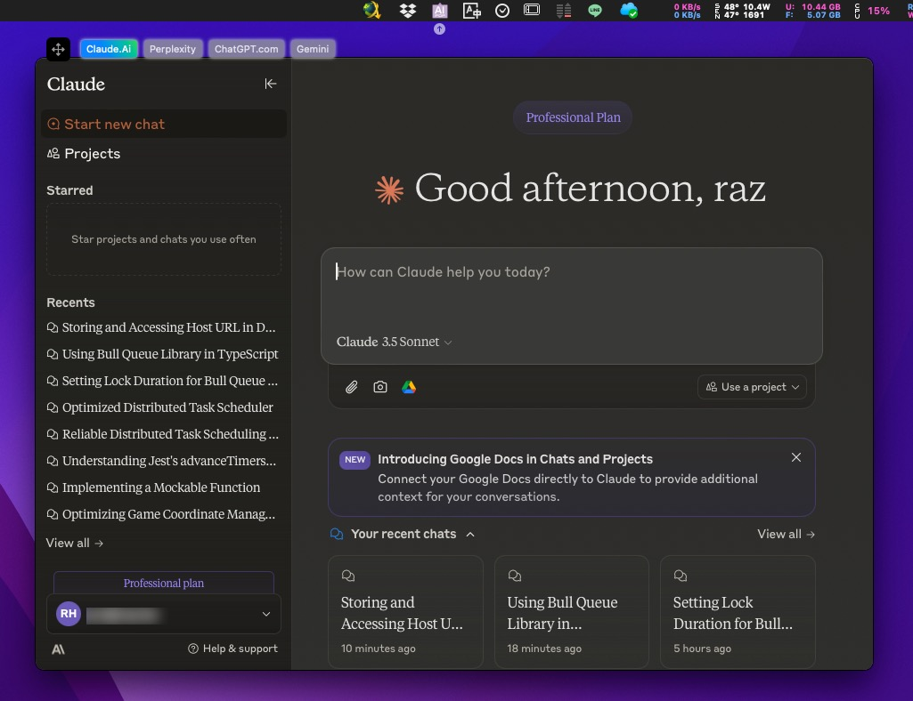
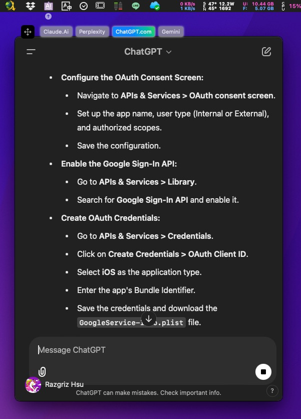

	

		
	

	<h1 align="center">AIPop</h1>
	<h4 align="center">Lightning-Fast Claude/ChatGPT/Perplexity/Gemini launcher for macOS</h4>

## Features

- [x] Quickly popup the `Claude` / `ChatGPT` / `Perplexity` / `Gemini` window without searching through many apps.
    > 可快速彈出 `Claude` / `ChatGPT` / `Perplexity` / `Gemini` 對話視窗，無需在許多程式中尋找

- [x] Floating buttons, quickly switch between different AIs.
    > 浮動的透明按鈕，讓你快速在不同AI間切換

- [x] Be freely resized and repositioned to your preference, supports between multiple monitors.
    > 可自行調整喜歡的視窗位置及大小，並且支援在多螢幕間切換

- [x] Default shortcut key (⌘+⇧+3) can be customized.
	> 預設快速鍵 (⌘+⇧+3) 可自行修改

- [x] Shortcut (⌘+⇧+R) for reloading the Web, useful when UI getting slow.
    > 快速鍵 (⌘+⇧+R) 在介面變慢的時候可以使用

## Screenshots

> [!NOTE]
>
> The current program is primarily written to suit my usage habits.
> 
> If you have any issues or suggestions, please feel free to open an issue or contribute.
