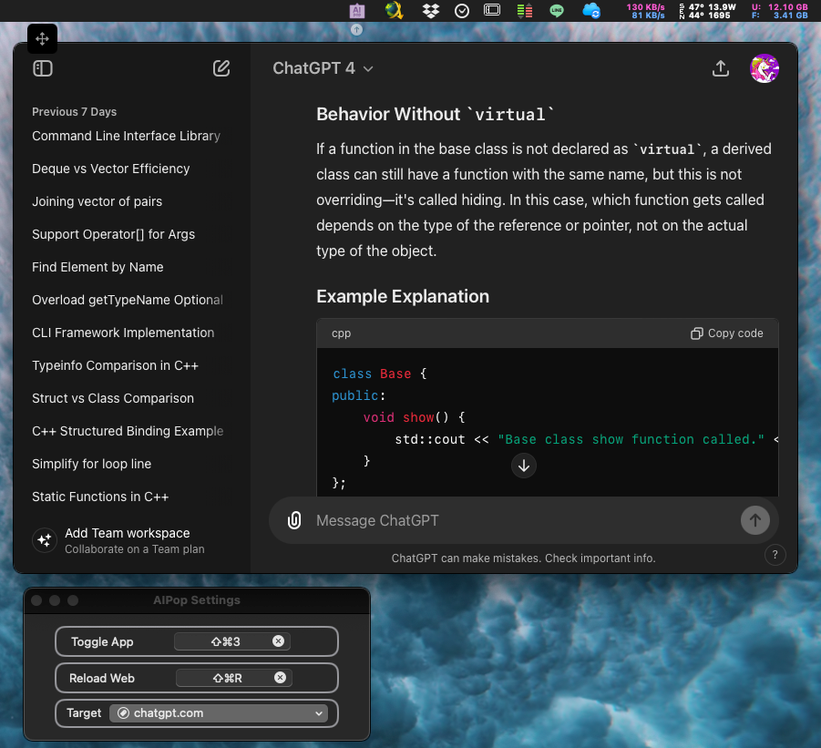
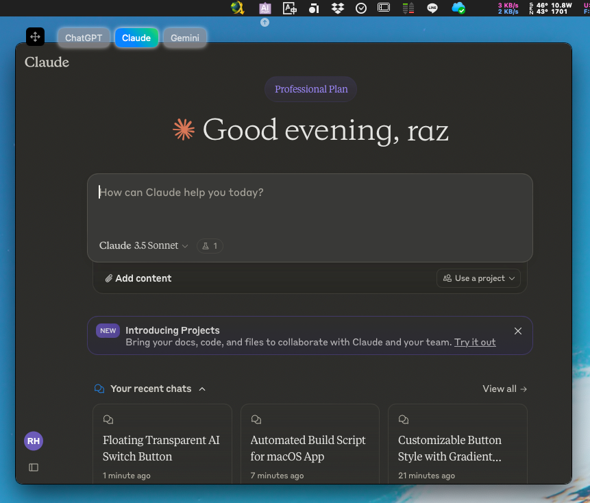

	

		
	

	<h1 align="center">AIPop</h1>
	<h4 align="center">Lightning-Fast ChatGPT/Claude launcher for macOS</h4>

## Features

- [x] Quickly pop up the ChatGPT or Claude window without searching through many programs.
    > 可快速彈出 chatgpt.com 或 claude.ai AI對話視窗，無需在許多程式中尋找

- [x] Default shortcut key (⌘+⇧+3) can be customized.
	> 預設快速鍵 (⌘+⇧+3) 可自行修改

- [x] Shortcut (⌘+⇧+R) for reloading the Web, useful when UI getting slow.
    > 快速鍵 (⌘+⇧+R) 在介面變慢的時候可以使用

## Screenshot for chatgpt

	

## Screenshot for claude

	

> [!NOTE]
> The current program is primarily written to suit my usage habits.
> 
> If you have any issues or suggestions, please feel free to open an issue or contribute.